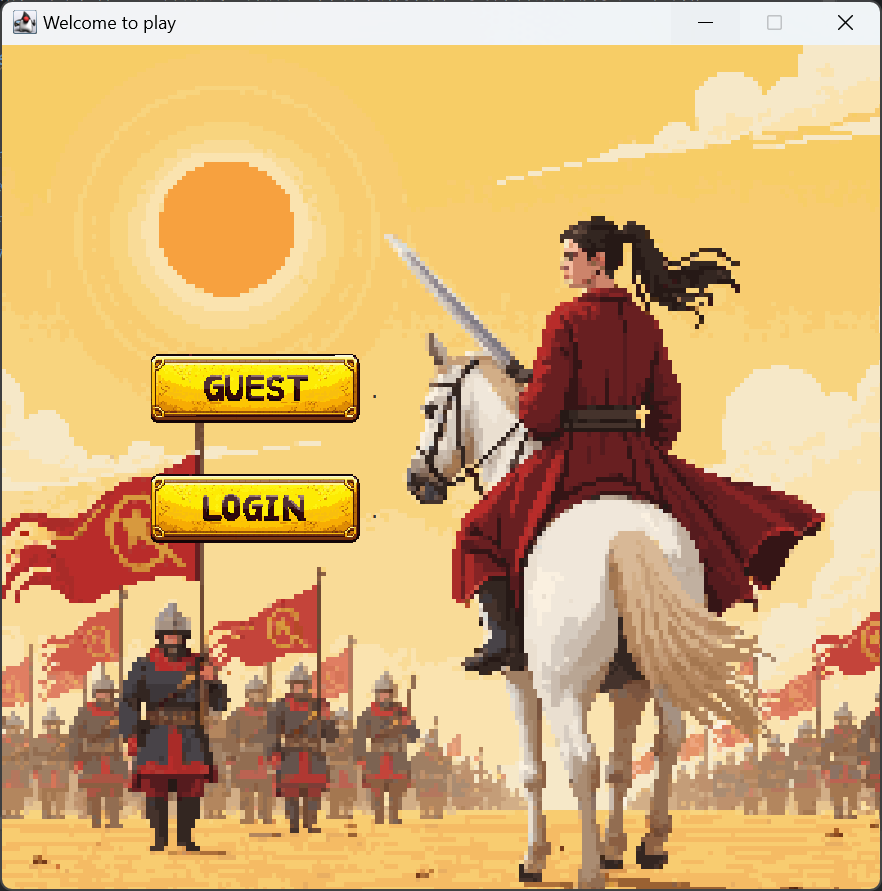
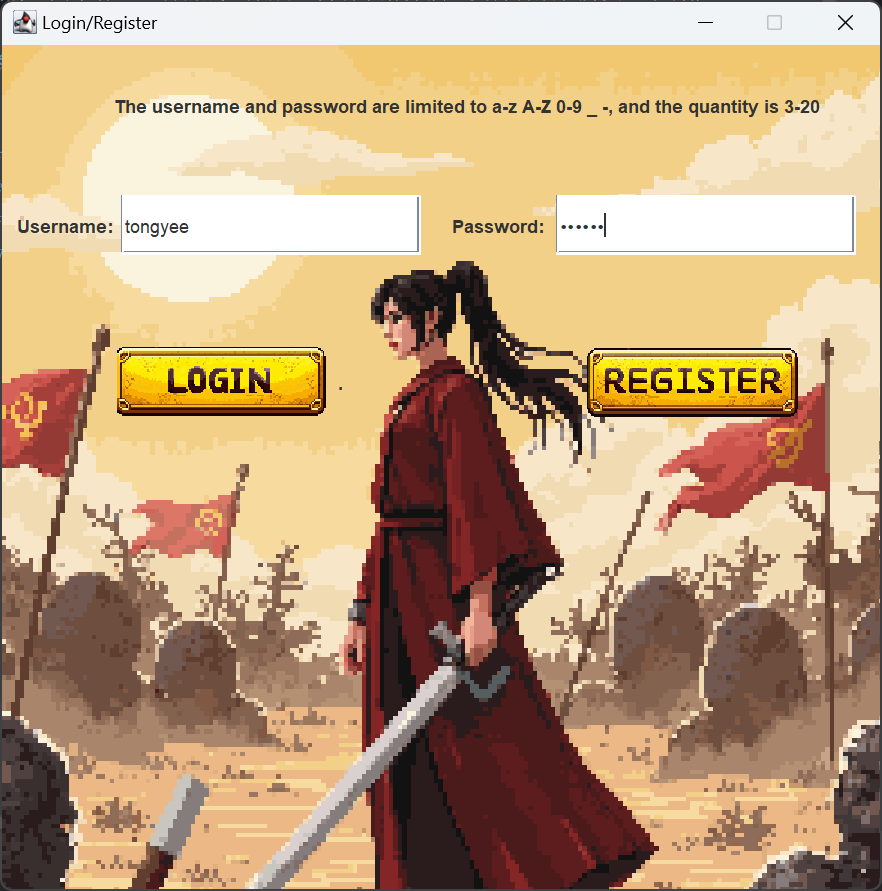
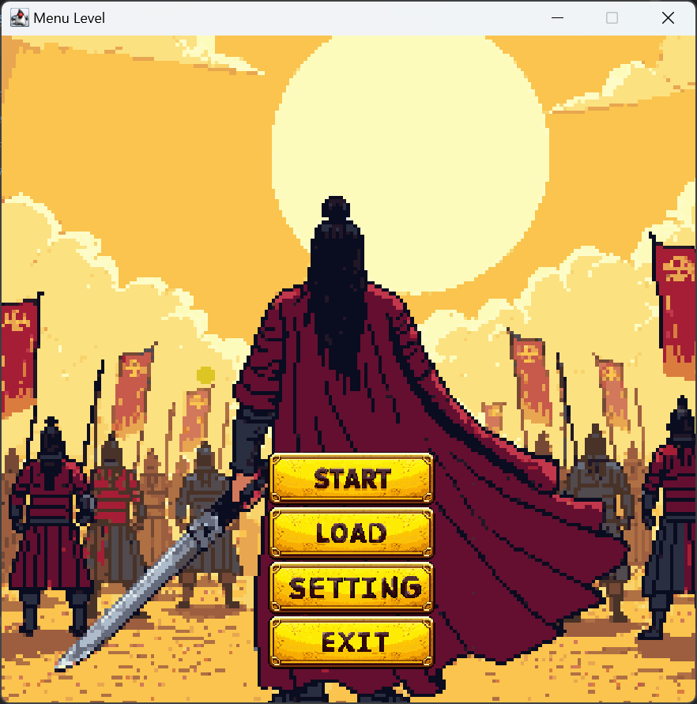
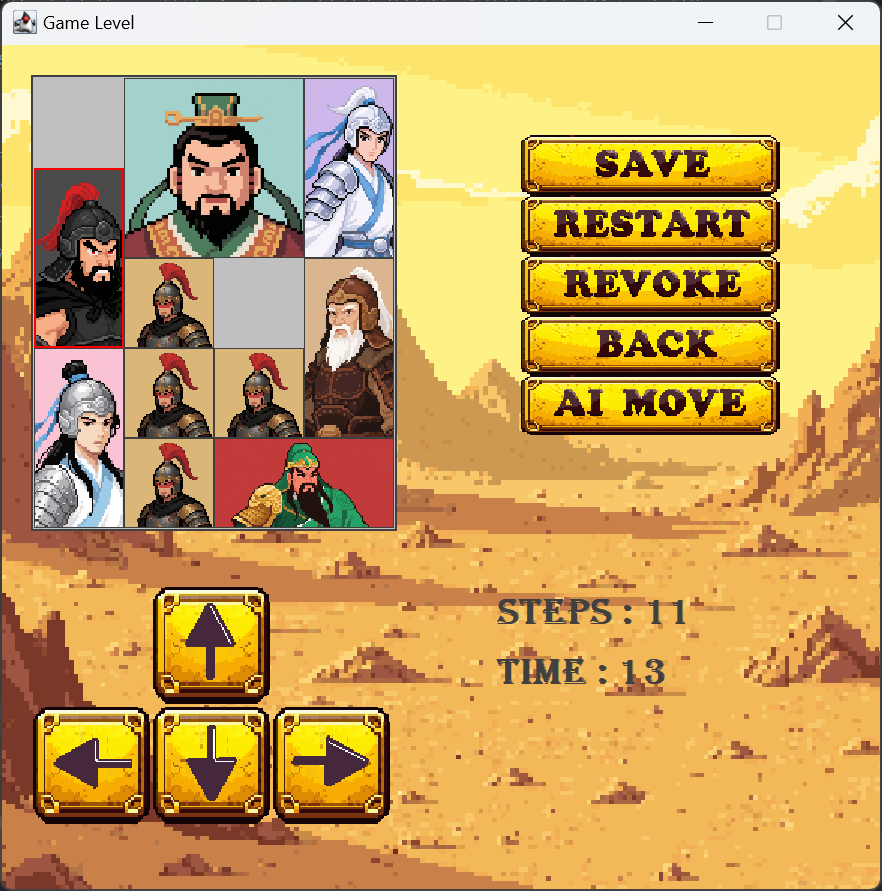

# 华容道游戏 - Klotski Puzzle Game

[](https://openjdk.org/)
[](https://github.com/TongYee325/KlotskiPuzzleProject)

一款基于Java Swing开发的经典华容道益智游戏，集成AI自动求解算法，支持撤销功能。


## 目录
- [功能特性](#功能特性)
- [快速开始](#快速开始)

## 游戏截图
  
  
  
  
## 功能特性

### 核心玩法
- 🧩 标准4x5棋盘布局
- 🪀 七类经典角色方块
    - 曹操 (2x2)
    - 关羽 (2x1)
    - 五虎将 (1x2)
    - 士兵 (1x1)
- 🎮 多种操作方式
    - 键盘方向键控制
    - 上下左右按钮控制

### 进阶功能
- 🤖 **AI自动求解**
    - A*算法 + 曼哈顿距离启发式
    - 求解步数为最优解
- 📊 游戏数据统计
    - 移动步数记录
    - 时间统计
- 🎧 沉浸式体验
    - 背景音乐支持
    - 滑块音效
    - 可调节音量控制

## 快速开始

### 环境要求
- JDK 17+

### 安装步骤
```bash
# 克隆仓库
git clone https://github.com/TongYee325/KlotskiPuzzleProject.git

# 运行游戏
编译并运行Main.java中的main方法