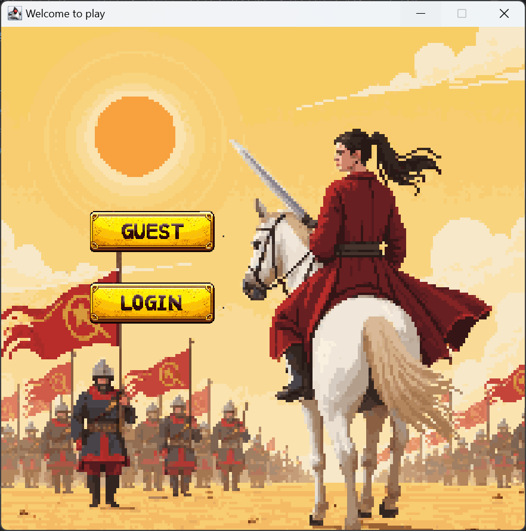
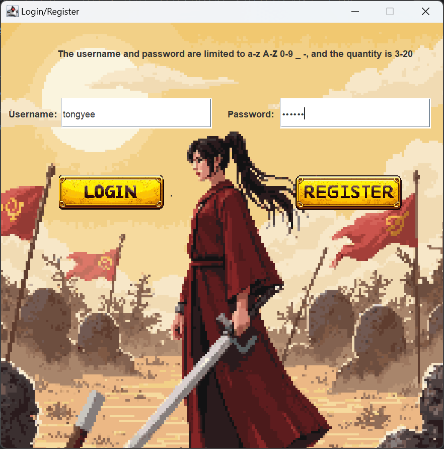
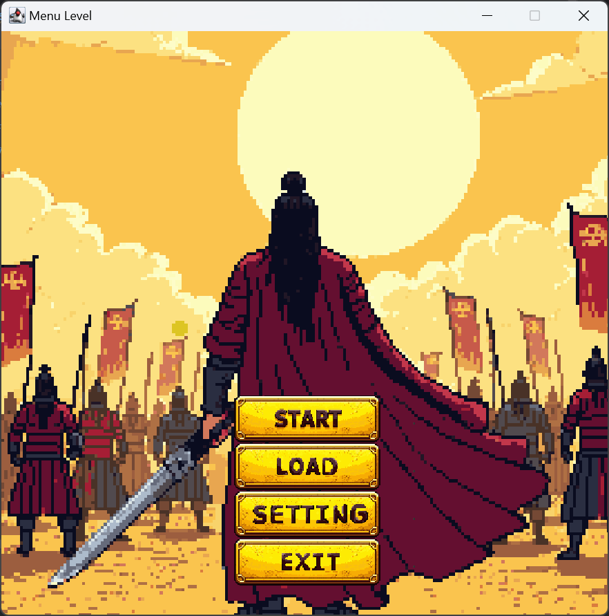
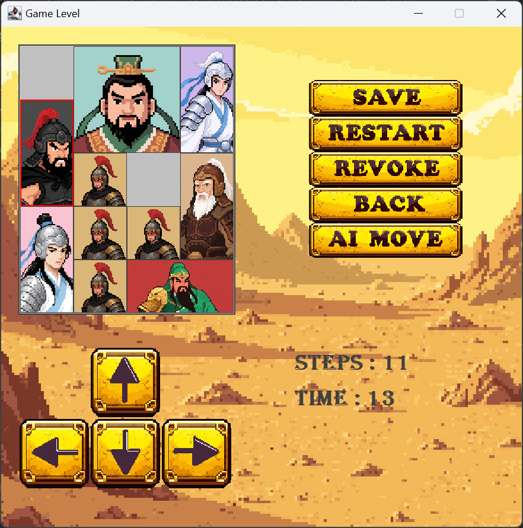

# Klotski Puzzle Game

[](https://openjdk.org/)

A classic Klotski puzzle game developed based on Java Swing, integrating an AI automatic solving algorithm and supporting undo functionality. The algorithm adopts A* algorithm + Manhattan distance.

# Demo


## Table of Contents
- [Features](#features)
- [Quick Start](#quick-start)

## Game Screenshots
  
  
  
  
## Features

### Core Gameplay
- 🧩 Standard 4x5 board layout
- 🪀 Seven types of classic character blocks
    - Cao Cao (2x2)
    - Guan Yu (2x1)
    - Five Tiger Generals (1x2)
    - Soldiers (1x1)
- 🎮 Multiple control methods
    - Keyboard arrow keys control
    - Up/Down/Left/Right button control

### Advanced Features
- 🤖 **AI Automatic Solving**
    - A* algorithm + Manhattan distance heuristic
    - Solves for the optimal number of steps
- 📊 Game Statistics
    - Move count tracking
    - Time tracking
- 🎧 Immersive Experience
    - Background music support
    - Sliding sound effects
    - Adjustable volume control

## Quick Start

### Requirements
- JDK 17+

### Installation Steps
```bash
# Clone the repository
git clone https://github.com/TongYee325/KlotskiPuzzleProject.git

# Run the game
Compile and run the main method in Main.java